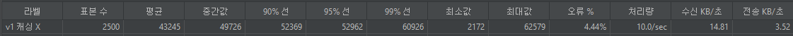
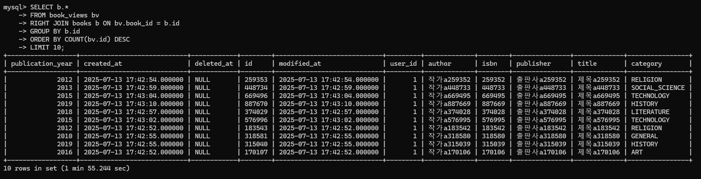
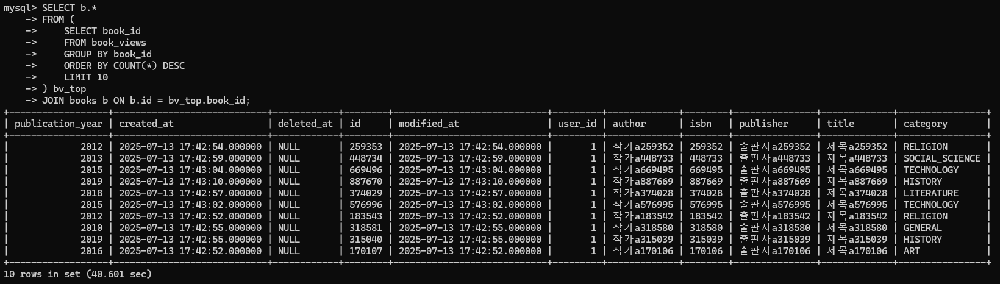

# 플러스 프로젝트

## 프로젝트 소개
- 프로젝트 명: 북북이
- 주제: 사용자들이 책에 대해 진지할 필요 없이, 자유롭고 유쾌하게 감상을 공유할 수 있는 경량 독서 감상 커뮤니티 플랫폼

<br>

## 프로젝트 핵심 기술
- 사용자 인증/인가를 위한 Spring Security + JWT + Redis 블랙리스트 기능 구현
- 자주 반복되는 조회 기능에 Redis 기반 캐싱 기능 도입
- AOP 를 사용한 로깅 구현
- N+1 방지 기능 도입
- GitHub Actions + Docker + EC2 기반 배포 자동화 구성

| **분야** | **기술 스택** |
| --- | --- |
| **Language** | Java 17 |
| **Build Tool** | Gradle 8.14.2 |
| **Framework** | Spring Boot 3.5.0, Spring Data JPA (Hibernate 6.5.2.Final), Spring Security |
| **Database** | MySQL 8.0+ |
| **ORM** | JPA, QueryDSL 5.1.0 |
| **Infra** | Docker, AWS EC2, RDS (MySQL) |
| **CI/CD** | GitHub Actions |
| **Testing** | JUnit5, Spring Boot Test |

## 배포 (AWS EC2)
[✔️] health check API: [http://ec2-15-164-226-99.ap-northeast-2.compute.amazonaws.com:8080/api/health](http://ec2-15-164-226-99.ap-northeast-2.compute.amazonaws.com:8080/api/health)

<br>

## 프로젝트 실행 가이드
### 코드 복제
```bash
git clone https://github.com/gajicoding/spring-plus.git
cd spring-plus
```

### 빌드 (윈도우)
```bash
./gradlew build
```

### 실행 (윈도우)
```bash
java -jar .\build\libs\book-api-0.0.1-SNAPSHOT.jar
```

<details>
<summary>MySQL 설정</summary>

```bash
ALTER TABLE books
  ADD FULLTEXT INDEX ft_fields (title, author, publisher) WITH PARSER ngram;
```
</details>

<details>
<summary>환경 변수 설정 예시</summary>

```properties
DB_URL=jdbc:mysql://localhost:3306/book_api
DB_USERNAME=root
DB_PASSWORD=1234

SECRET_KEY=yourSecretKeyHere123456789012345678901234567890

REDIS_HOST=127.0.0.1
REDIS_PORT=6379
```
</details>

<br>

## 캐싱 전/후 성능 비교



- 평균 응답 속도: 43245 → 1 (약 43,245배 개선)
- 오류 %: 4.44% → 0% (오류 완전 제거)
- 처리량: 10.0/sec → 250.3/sec (약 25배 증가)

<br>

## 쿼리 최적화 전/후 성능 비교
### 쿼리 최적화 전


### 서브쿼리 적용


### Covering Index 적용
```SQL
CREATE INDEX idx_book_view_book_id_id ON book_view(book_id, id);
```


- 카운트용 별도 테이블 구현도 검토했으나, Redis 캐시 기능으로 대체하여 별도 구현하지 않았습니다.

<br>

## 문제 해결 (트러블 슈팅)
- [[Spring] Log Aspect 기능 구현 과정 트러블슈팅](https://hyeonha.tistory.com/43)

